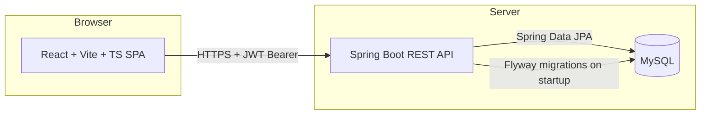

# Architecture

Status: **implemented**. This described the target architecture while the phases in
`docs/PLAN.md` were being built; it now describes what is there, with the notes below
recording where the finished code diverged from the plan and why.

## High-level



- Frontend and backend are fully decoupled: the SPA only talks to the backend via REST
  + JSON, authenticated with a JWT.
- No server-side rendering / no shared session state — the backend is stateless per
  request (auth state lives entirely in the JWT).

## Repository layout

```
Sisenco-Digital/
├── backend/weekly-report-backend/   # Spring Boot app (Java 21, Maven)
├── frontend/                        # React + Vite + TS + Tailwind SPA
├── docs/                            # planning & design docs (this folder)
├── CLAUDE.md                        # onboarding notes for AI assistants
└── README.md                        # setup instructions (assignment deliverable)
```

No separate top-level `database/` folder. Reasoning: MySQL schema is owned by the
backend via **Flyway migrations** living at
`backend/weekly-report-backend/src/main/resources/db/migration/`, which is the
conventional Flyway location and keeps schema versioned alongside the code that
depends on it. Seed data is also a Flyway migration (or a dedicated seed migration run
after the base schema). The ER diagram deliverable (an exported image) can live under
`docs/diagrams/` once produced.

## Backend (Spring Boot)

Layered, standard Spring Boot structure:

```
com.technical.task.weeklyreportbackend
├── config/          # SecurityConfig, JwtConfig, CorsConfig, OpenAPI/Swagger config
├── security/         # JWT filter, JwtService (issue/parse), UserDetailsService impl
├── controller/       # REST controllers, thin — delegate to services
├── service/          # business logic, workflow transitions, authorization checks
├── repository/       # Spring Data JPA repositories
├── domain/           # JPA entities
├── dto/              # request/response DTOs (never expose entities directly)
├── mapper/           # entity <-> DTO mapping
└── exception/        # @ControllerAdvice global handler, custom exceptions
```

Key decisions:
- **Validation**: Jakarta Bean Validation annotations on request DTOs
  (`@NotBlank`, `@Size`, etc.), enforced at the controller boundary.
- **RBAC**: Spring Security method security (`@PreAuthorize("hasRole('MANAGER')")`) on
  service or controller methods, backed by a `Role` enum on `User`. Ownership checks
  (a team member can only touch their own reports) are explicit checks in the service
  layer, not just role checks — a `MANAGER` role does not bypass "must be the report's
  owner or a manager" logic where relevant.
- **Report versioning**: a `Report` is the stable identity (one per user+week); each
  submit/resubmit creates a new `ReportVersion` snapshot. See `docs/DATA_MODEL.md`.
- **Pagination/filtering**: list endpoints (e.g. `GET /api/reports`) accept
  `page`/`size` plus filter query params (team member, project, date range, status),
  using Spring Data `Pageable` + JPA Specifications (or derived query methods if
  filters stay simple).

## Frontend (React + Vite + TypeScript + Tailwind)

```
frontend/src/
├── pages/            # route-level screens (see docs/PAGES.md for the full list)
├── components/       # reusable, presentation-only UI (Table, StatusBadge, Modal, ...)
├── features/          # domain modules grouped by area: auth, reports, dashboard,
│                      # projects, users — each with its own components/hooks/types
├── api/               # thin fetch/axios wrapper + one function per endpoint,
│                      # attaches the JWT via an interceptor
├── hooks/             # cross-cutting hooks (useAuth, useDebounce, ...)
├── context/           # AuthContext (current user, role, token)
├── routes/            # route definitions + <ProtectedRoute role="MANAGER">
├── types/             # TS interfaces mirroring backend DTOs
├── lib/               # small pure helpers (date/number formatting, week maths, keyed fetch)
└── components/charts/ # ColumnChart, BarList, StackedBarList — no charting library
```

The tree above is the plan; what actually got built is flatter. `hooks/` and `context/`
never appeared — `auth/` holds the context, provider and `useAuth` together, which is
where you'd look for them anyway — and `charts/` lives under `components/` since the three
charts are presentation-only like every other component there.

Key decisions:
- **Auth state**: JWT stored client-side (kept in memory + `localStorage` for
  persistence across reloads — acceptable for this assignment's scope; a production
  system would prefer an httpOnly cookie, noted as a future improvement).
- **Route protection**: `ProtectedRoute` reads the decoded role from `AuthContext` to
  hide/redirect manager-only routes. This is a UX convenience only — the backend is
  the actual authority and re-checks role/ownership on every request.
- **Forms**: basic client-side validation (required fields, percentage ranges, etc.)
  before submit; backend validation is still authoritative.
- **Styling**: Tailwind CSS utility classes; shared primitives (buttons, inputs, badges)
  factored into `components/` rather than repeated per page.
- **Charts: no charting library.** See the decision below.
- **URL as filter state** on the team dashboard: every filter, the selected week and the
  page number live in the query string rather than in component state, so a filtered view
  is shareable, the Back button means something, and a summary tile can be an ordinary
  link into the same page with a filter applied.

## Auth flow (JWT)

1. `POST /api/auth/register` → creates a `User` with a role (see `docs/DATA_MODEL.md`
   for how role assignment is decided at signup vs. by an admin).
2. `POST /api/auth/login` → validates credentials, returns a signed JWT (claims:
   subject = user id, role, expiry).
3. Frontend stores the token and attaches `Authorization: Bearer <token>` to every
   subsequent request.
4. Backend `JwtAuthFilter` validates the token per request, populates the Spring
   Security context, and downstream `@PreAuthorize`/service checks enforce RBAC.
5. Logout is client-side (drop the token); no server-side session to invalidate given
   the stateless design. (Token expiry + optional refresh flow noted as a possible
   future improvement, not required for this assignment.)

## Decided: `Role` model

The assignment's "Required roles" list names exactly two: **Team Member** and
**Manager / Admin** — the `/` is one role referred to by either name, not two separate
roles. The other "admin" mentions in the PDF (role assignment "by an admin", and the
"(admin)" tag on the user-management page) just describe that same role doing an
admin-flavored task, not a distinct permission tier.

**Decision: two roles total — `TEAM_MEMBER` and `MANAGER`.** `MANAGER` also has access
to the user-management page (invite/remove team members, assign roles). No separate
`ADMIN` role — introducing one would be extra scope beyond what's asked, not a
requirement.

## Decided: charts without a charting library

Recharts was the recorded default. Phase 6 went the other way: the four dashboard datasets
are each "a label and a number", and a div whose width or height is a percentage renders
exactly that. `components/charts/` holds three components — `ColumnChart` (the weekly
trend), `BarList` (hours per project, hours per task type) and `StackedBarList` (each
member's reports by status) — totalling well under 200 lines.

Why that was the better trade here:

- It would have been the frontend's largest dependency, and the only one added since the
  scaffold. The **live-coding round asks about code in this repo**, so a chart the author
  can explain line by line is worth more than one configured through a library's props.
- CSS percentages are genuinely responsive. A scaled SVG `viewBox` shrinks its own text,
  so axis labels become illegible on a phone — and mobile responsiveness is a graded
  requirement.
- Zero risk around React 19 peer ranges, which are still uneven across chart libraries.

If the charts ever need axes, zooming, tooltips positioned off-element, or a chart type
that isn't bars, add Recharts then — that is the point at which a library starts paying
for itself. Nothing about the current code makes the swap harder: each chart takes a plain
array and is used in exactly one place.

## Note: 400 before 403 on manager-only writes

A team member POSTing an **invalid** body to a manager-only endpoint gets 400, not 403.
Spring resolves and validates `@RequestBody` while binding the method arguments, which
happens before the method-security interceptor runs. With a **valid** body the same
request is 403, and nothing is ever written either way — verified for every write endpoint
in Phase 6. It discloses the endpoint's validation shape, not any data, so it is left as
is rather than reordered.

## Open questions / things to confirm before or during implementation

- Whether the AI Chat Assistant bonus gets attempted, and if so which LLM/integration
  approach.
