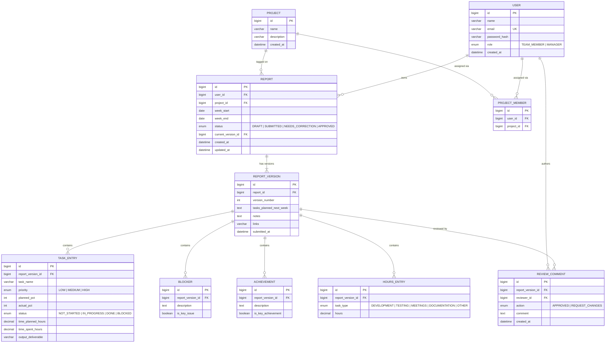

# Data Model

Status: **planned, not yet implemented**. This is the working draft for the ER diagram
deliverable (Section 3 of the assignment) — export an actual diagram image from this
once it stabilizes (e.g. via dbdiagram.io, drawio, or a Mermaid render) and save it
under `docs/diagrams/`.

## Entity-relationship overview

## Why versioning is modeled this way

The assignment requires that when a report goes `Needs Correction → edited →
resubmitted`, the **previous content stays visible**, and a manager must be able to see
which version a given comment was made against.

- `REPORT` is the stable identity for "this user's report for this week" — it holds the
  current `status` and a pointer to the `current_version_id`.
- Every submit (including every resubmit after correction) creates a new
  `REPORT_VERSION` row — a full snapshot of that submission's content (tasks, blockers,
  achievements, hours, planned-next-week, notes). Nothing is overwritten in place.
- `TASK_ENTRY`, `BLOCKER`, `ACHIEVEMENT`, `HOURS_ENTRY` all hang off a specific
  `REPORT_VERSION`, not the `REPORT` — so old versions keep their exact original rows
  even after a new version is created.
- `REVIEW_COMMENT` also hangs off a specific `REPORT_VERSION`, which directly answers
  "which version was this comment made against."
- Draft edits (before first submit) can update the single not-yet-submitted version in
  place, or always create version 1 on first save — a small implementation choice to
  make during Phase 2 (see `docs/PLAN.md`); the simplest option is: **draft = version 0,
  mutated in place; every actual "Submit" click snapshots/finalizes a version and starts
  the next one on the next edit**.

## RBAC notes reflected in the schema

- A report's content (`REPORT_VERSION` and its children) is only ever written by its
  owner (`REPORT.user_id`). Managers write `REVIEW_COMMENT` rows and update
  `REPORT.status` — never the version content itself. This maps directly to the
  assignment's "managers can only edit status/comment fields" requirement.
- Every report-scoped query in the backend must filter by `user_id = currentUser.id`
  for `TEAM_MEMBER` callers; `MANAGER` callers may query across all users. This is
  enforced in the service layer, not just at the controller/role level.

## Role model (decided)

`Role` enum: `TEAM_MEMBER`, `MANAGER`. The assignment's "Required roles" list names
exactly these two ("Manager / Admin" is one role, not two) — see `docs/ARCHITECTURE.md`
for the full reasoning. `MANAGER` also covers the user-management page (invite/remove
team members, assign roles). No `ADMIN` role.
