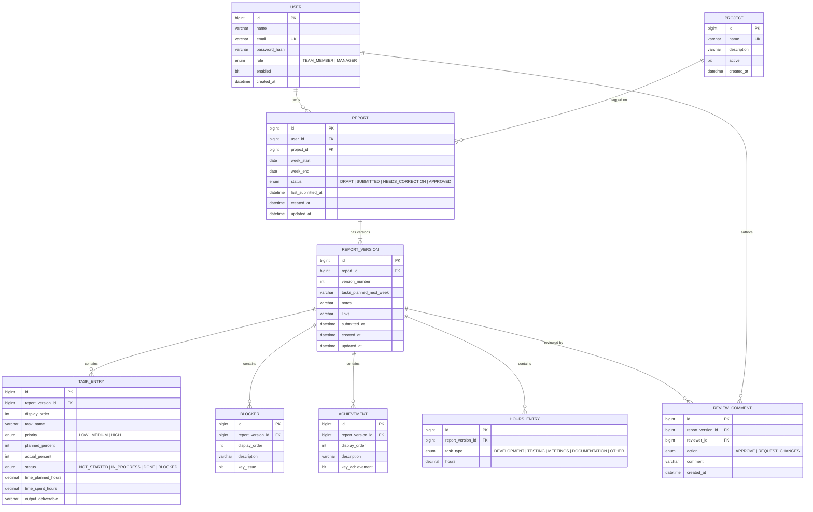

# Data Model

Status: **implemented as of Phase 2.**

> **`docs/PHASE2_SPEC.md` is the authoritative reference** for the exact tables, column
> types, and lifecycle rules — it is what the code and the `V2__create_reports_schema.sql`
> migration were built from, and it resolves several points this file left open. Read that
> first; this file is the conceptual overview and the basis for the ER diagram deliverable.

Export a diagram image from this (dbdiagram.io, drawio, or a Mermaid render) and save it
under `docs/diagrams/` for the assignment's ER-diagram deliverable. Note the shape below
differs from the shipped schema in two ways, both deliberate:
- `PROJECT_MEMBER` is **not implemented** — assigning members to projects is optional in the
  brief and is deferred to Phase 3. Drop it from the exported diagram, or implement it
  first; the graded diagram must not show a table the database doesn't have.
- `REPORT` has **no `current_version_id`** column. The current version is the highest
  `version_number`, which avoids a circular FK between `reports` and `report_versions`.

## Entity-relationship overview

Column names and types above are the ones the migrations actually create — see
`db/migration/V1`, `V2` and `V3`. Exported images of this diagram, for the slide deck and the
submission folder, live in [`diagrams/`](diagrams/) — `er-diagram.png` for Google Slides,
which cannot import SVG, and `er-diagram.svg` for reading on screen.

## Why versioning is modeled this way

The assignment requires that when a report goes `Needs Correction → edited →
resubmitted`, the **previous content stays visible**, and a manager must be able to see
which version a given comment was made against.

- `REPORT` is the stable identity for "this user's report for this week" — it holds the
  `status` and the week. The current version is the highest `version_number`; there is no
  pointer column, which keeps `reports` and `report_versions` free of a circular FK.
- `submitted_at IS NULL` marks the one open working copy; a non-null value marks a frozen
  snapshot that **no code path ever writes again**.
- **Lazy fork** (as implemented): draft edits mutate the open version in place, submit
  freezes it, request-changes creates no version at all, and the owner's first edit *after*
  a freeze forks version `n+1` populated from that request. So a draft edited ten times is
  still one version, and a full correction cycle produces exactly two.
- `TASK_ENTRY`, `BLOCKER`, `ACHIEVEMENT`, `HOURS_ENTRY` all hang off a specific
  `REPORT_VERSION`, not the `REPORT` — so old versions keep their exact original rows
  even after a new version is created.
- `REVIEW_COMMENT` also hangs off a specific `REPORT_VERSION`, which directly answers
  "which version was this comment made against."

Why lazy rather than forking eagerly when the manager requests changes: it keeps the
manager's entire write surface to inserting a review comment and updating the report's
status, so "managers cannot rewrite report content" holds structurally rather than by
convention. It also removes any deep-copy step, since the new version is populated from the
incoming payload. See `docs/PHASE2_SPEC.md`.

## RBAC notes reflected in the schema

- A report's content (`REPORT_VERSION` and its children) is only ever written by its
  owner (`REPORT.user_id`). Managers write `REVIEW_COMMENT` rows and update
  `REPORT.status` — never the version content itself. This maps directly to the
  assignment's "managers can only edit status/comment fields" requirement.
- Every report-scoped query in the backend must filter by `user_id = currentUser.id`
  for `TEAM_MEMBER` callers; `MANAGER` callers may query across all users. This is
  enforced in the service layer, not just at the controller/role level.

## Role model (decided)

`Role` enum: `TEAM_MEMBER`, `MANAGER`. The assignment's "Required roles" list names
exactly these two ("Manager / Admin" is one role, not two) — see `docs/ARCHITECTURE.md`
for the full reasoning. `MANAGER` also covers the user-management page (invite/remove
team members, assign roles). No `ADMIN` role.
